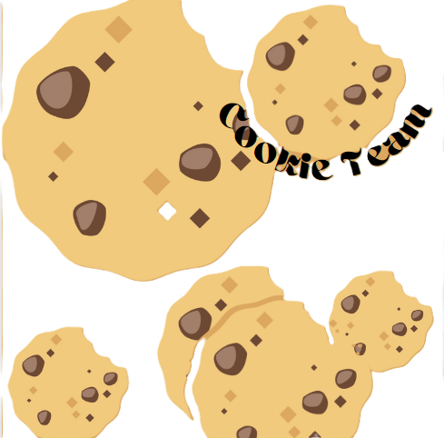
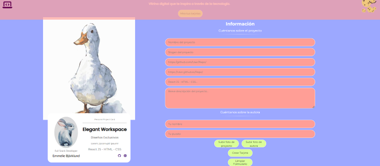
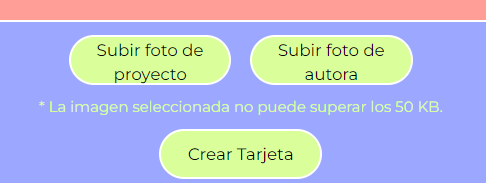
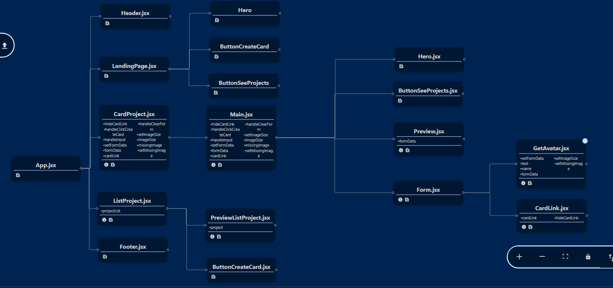

# ¡¡Proyectos molones!! :)
https://avispas.github.io/project-promo-V-module-3-team-1/   ( frontend - SPA )

https://github.com/Tam-Weibel/project-promo-V-module-4-team-1  (updated frontend + backend - SPA)

## Deadline Backend:
Lunes, 04 de Marzo : demo del proyecto.

-Los requisitos a añadir a la parte de back end de nuestra SPA son crear un servidor básico, una API REST para listar y crear proyectos, un motor de plantillas para visualizar los proyectos y un servidor estáticos para servir la web desde un nuevo servidor.

Trabajaremos con una base de datos MYSQL para poder gestionar los datos recibidos por los usuarios en el formulario de la aplicación web, almacenados en el local storage del navegador hasta el momento.

El diseño front end presentado en la demo anterior del 13 de Febrero se personalizará y se mejorarán detalles en las funncionalidades, como la validación de los campos a cumplimentar, la aparición de mensajes o alertas  más específicos para el usuari@ (ambas fotos requeridas, por ejemplo).

Se ha integrado un loader para la espera de la carga de la URL generada para cada usuario al pulsar el botón de "crear tarjeta".

## Deadline Frontend:
Martes, 13 de Febrero : demo del proyecto.

. Se nos pidió dar funcionalidad a una página cuyo objetivo es crear una ficha tipo tarjeta, donde el usuario rellenará un formulario con sus datos, pudiendo añadir trabajos personales de desarrollo de software, entre otros, junto con documentos gráficos tanto de su persona para el perfil de la tarjeta, como del propio proyecto en sí. 
Tras la creación de la tarjeta , esta generará un link personal y una previsualización de la misma. 

El formulario había de responder a eventos tanto para la cumplimentación de campos, subida de archivos locales del usuario, guardar los datos en el navegador , por lo que está en contacto directo con una API que recoge y devuelve estos datos.

Hemos conseguido enviar un objeto con la estructura de datos a rellenar, permanece en memoria aunque se refresque la página, por lo que recuperaremos los datos como se solicitaba.

Decidimos adaptar y revisar el código heredado, para seguir y corregir la maquetación HTML; Hubo que adaptar secciones del documento y estilos pra corregir conflictos que surgían que no permitían seguir el diseño / reparto de elementos.

Tuvimos ciertos conflictos con la API que intercambiaba las fotos de usuario y proyecto al cargarlas en la preview, con el LocalStorage que vaciaba el objeto al refrescar, ambas solucionadas. 

Los campos a rellenar tiene limitación de caracteres en el apartado de nombre , puesto , ...pero no en aquel para la URL de proyecto. Hemos limitado y puesto una advertencia en la carga de foto de local de usuario.

Incorporamos un botón de reset para vaciar el local storage y los campos del formulario y hemos trabajado en la creación de una nueva estructura de componentes donde los ficheros están interrelacionados a través de rutas estáticas.
También maquetamos una landing sencilla de bienvenida, que da acceso a la página principal y a su vez redirije al usuario a la página con los proyectos.

	
## Tech Stack

**Maquetación:** HTML5, CSS3, SASS

**Interactividad:** JAVASCRIPT E-26, APIs de terceros (*14-02-2024: trabajando en creación de base de datos, servidor y API propias)

**Framework:** React JS 

**Data Base:** MySQL

**Server:** Node JS, Express JS

**Node Package Manager:**

**Design:** Zeplin
 
**Local Development Server:**  Vite

Uso de Sass para el diseño y los estilos de la página web: anidamientos, nomenclatura BEM, utilziación de variables y mixins para refctorizar código referente a estilos comunes.

Uso de media queries para que el diseño sea adaptable a cualquier dispositivo, priorizando el diseño de mobile first, pero pensando en distintas resoluciones de dispositivos y acciones de los usuarios con respecto a la ventana del navegador.

uso de Git para el control de versiones del proyecto: creación de ramas para división del trabajo, ticket de adaptaciones de funcionalidades específicas o correcciones de estilos.

Todo el código ha sido elaborado utilizando VS Studio  Code, con las dependencias necesarias y específicas para integar el trabajo con librerías como React JS, adaptando la configuración de Vite

## API Reference

#### Get all items

https://dev.adalab.es/api/projectCard 

## 🚀 About Us:

Cookie Team es un equipo de 5 programadoras de software :)
A fecha de entrega del proyecto estamos en plena formación, cursando un bootcamp de desarrollo web para lograr nuestro objetivo de ser full stack developers.
Nos encanta ver la evolución de nuestros perfiles en este nuevo mundo tecnológico que esperamos nos reciba en su comunidad, ya que tenemos muchísimo interés en seguir formándonos y mejorando gracias a nuestro esfuerzo y colaboración con otr@s Code Lovers.

Partimos de sitios muy distintos, lo que nos permite trabajar con una visión diferente pero con una meta común : hacer aplicaciones y páginas webs cohesionadas, responsive, accesibles y adaptadas a las necesidades del mercado.

*********************************************************************************************+

We are a five team woman, studying a development software's bootcamp.

We love to code!! We are trying to work hard everyday to improve our frontend and backend skills and also learning about the interesting Agile and Scrum practices.

Our origins are pretty different so we use those skills to help us in our current journey.

We are so pleased to show you all our last project, as requested by ours teachers, following the design we were asked for to reproduce.

## 🔗 Links
https://github.com/Diany0121

https://github.com/94Jennn

https://github.com/Avispas

https://github.com/Tam-Weibel

https://github.com/LauraSabrin

Hemos aprendido a trabajar resolviendo y entendiendo numerosos conflictos, por lo que la fluidez y los tiempos han sido diferentes para nosotras esta vez, aunque estamos orgullosas de comprobar que nuestro  perfil como programadoras ha evolucionado, tanto en la comprensión de conceptos y la magnitud y complejidad del proyecto. 

## Screenshots

